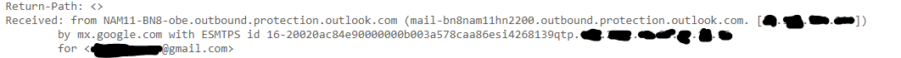

# yOu hAvE bEeN cHoSeN

One day a couple years ago i had revcieved an email claiming "<strong>i hAd bEeN cHoSeN</strong>", it was immediately clear that this was some sort of scam as: 
A) i have never been chosen for anything 
B) theres no Dicks sporting goods where i live.

 So i decided to dig a little deeper into it, but before that i wanted to find out how emails work in the first place

## How Emails Work

1) Emails are constructed and sent using a mail client like outlook or a web app like gmail 
2) The mail client sends the message to a MTA (Mail Transfer Agent) which is just the mail server which is running SMTP 
3) The MTA locates the the recipient's advertised mail server and sends it along 

we can look at the path that the email went through by looking at the <strong>Received</strong> entries
 

What i have found from my own testing is that NAM11-BN8-obe.outbound.protection.outlook.com or rather *.outbound.protection.outlook.com could be the result from the use of email alias in outlook.com, further more there is the case of the missing return-path which i am currently still investiagating and have no answers as of yet. 

The absence of X-Mailer header indicates that the email was probably crafterd via a web-based client instead of locally

